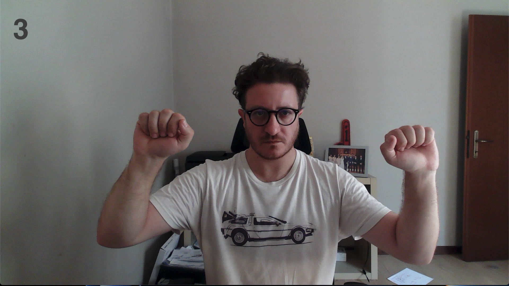

# 🛡️ Dr. Strange Shields - Gesture Control System

A real-time hand gesture recognition system that creates magical shield effects inspired by Doctor Strange, using computer vision and machine learning.

<br>
<p align="center">
  
</p>  <figcaption style="align: right">YouTube URL: https://www.youtube.com/watch?v=pXJt6sXhm_w.</figcaption>
<br>


## 📋 Table of Contents

- [Features](#-features)
- [Demo](#-demo)
- [Installation](#-installation)
- [Usage](#-usage)
- [How It Works](#-how-it-works)
- [Configuration](#-configuration)
- [Project Structure](#-project-structure)
- [Gesture Sequence](#-gesture-sequence)
- [Troubleshooting](#-troubleshooting)
- [Contributing](#-contributing)
- [License](#-license)

## ✨ Features

- **Real-time Hand Gesture Recognition**: Uses MediaPipe Holistic for accurate hand tracking
- **Machine Learning Classification**: SVM model for gesture classification
- **Visual Effects**: Overlays magical shield effects on detected hands
- **Multiple Output Modes**:
  - OpenCV window display
  - Virtual camera output (for use in video calls, streaming, etc.)
  - Both simultaneously
- **Sequential Gesture Activation**: Requires a specific sequence of gestures to activate shields
- **Configurable Parameters**: Adjustable thresholds and confidence levels
- **Graceful Shutdown**: Clean resource management with Ctrl+C handling

## 🎬 Demo

The system detects hand gestures in real-time and overlays shield effects when the correct sequence is performed:

1. Perform gesture KEY_1
2. Within 2 seconds, perform gesture KEY_2
3. Within 2 seconds, perform gesture KEY_3
4. Shields activate! ✨
5. Perform gesture KEY_4 to deactivate

## 🔧 Installation

### Prerequisites

- Python 3.9 or higher
- Webcam or camera device
- (Optional) Virtual camera software if using virtual camera output

### Install Dependencies

```bash
pip install -r requirements.txt
```

### Clone the Repository

```bash
git clone git@github.com:giova86/Python-DrStrangeShield.git
cd dr-strange-shields
```

### Project Structure

Ensure your project has the following structure:

```
dr-strange-shields/
├── main.py                    # Main application script
├── utils.py                   # Utility functions for MediaPipe
├── models/
│   └── model_svm.sav         # Trained SVM model
├── effects/
│   └── shield.mp4            # Shield video effect
└── README.md
```

## 🚀 Usage

### Basic Usage

Run with default settings (both OpenCV window and virtual camera):

```bash
python shield.py
```

### Advanced Usage

#### OpenCV Window Only

```bash
python shield.py --output window
```

#### Virtual Camera Only (Headless)

```bash
python main.py --output virtual
```

#### Custom Camera

```bash
python main.py --camera_id 1
```

#### Full Configuration

```bash
python main.py \
  --model models/model_svm.sav \
  --threshold 0.9 \
  --det_conf 0.5 \
  --trk_conf 0.5 \
  --camera_id 0 \
  --shield effects/shield.mp4 \
  --output both
```

### Command Line Arguments

| Argument | Short | Description | Default |
|----------|-------|-------------|---------|
| `--model` | `-m` | Path to trained ML model file | `models/model_svm.sav` |
| `--threshold` | `-t` | Prediction threshold (0-1) | `0.9` |
| `--det_conf` | `-dc` | Detection confidence (0-1) | `0.5` |
| `--trk_conf` | `-tc` | Tracking confidence (0-1) | `0.5` |
| `--camera_id` | `-c` | Camera device ID | `0` |
| `--shield` | `-s` | Path to shield video effect | `effects/shield.mp4` |
| `--output` | `-o` | Output mode: `window`, `virtual`, or `both` | `both` |

### Controls

- **Q key**: Quit application (when OpenCV window is active)
- **Ctrl+C**: Graceful shutdown from terminal

## 🧠 How It Works

### 1. Hand Detection

The system uses **MediaPipe Holistic** to detect and track hand landmarks in real-time:
- Detects 21 landmarks per hand
- Tracks both left and right hands simultaneously
- Calculates bounding boxes for each detected hand

### 2. Gesture Classification

- Extracts normalized hand landmark coordinates
- Feeds coordinates to a pre-trained **SVM (Support Vector Machine)** model
- Classifies gestures with probability scores
- Requires high confidence (>0.85 by default) for gesture recognition

### 3. Sequential Activation

The shield system requires a specific sequence:

```
KEY_1 → (within 2s) → KEY_2 → (within 2s) → KEY_3 → SHIELDS ACTIVATED
```

This prevents accidental activation and adds a "magical" element to the interaction.

### 4. Visual Effects

When shields are active:
- Reads frames from the shield video effect
- Removes black background (chroma keying)
- Scales and positions shields relative to hand positions
- Blends shield effect with camera feed using alpha blending
- Adjusts shield size based on hand bounding box dimensions (scaled by 1.5x)

### 5. Output Modes

- **Window Mode**: Displays in OpenCV window
- **Virtual Camera**: Outputs to virtual camera device (for OBS, Zoom, Teams, etc.)
- **Both**: Simultaneous output to both

## ⚙️ Configuration

### Adjusting Shield Size

Modify the `scale` variable in the code (default: 1.5):

```python
scale = 1.5  # Increase for larger shields, decrease for smaller
```

### Gesture Timing

Modify timeout values for gesture sequences:

```python
# Current: 2 seconds between gestures
if t1 + timedelta(seconds=2) > t2:  # Change 2 to desired seconds
```

### Prediction Confidence

Adjust the probability threshold for gesture recognition:

```python
if (prediction == 'key_1') and (pred_prob > 0.85):  # Change 0.85 to desired threshold
```

## 📂 Project Structure

### Required Files

#### `utils.py`
Must contain the following functions:
- `mediapipe_detection(frame, model)`: Processes frame with MediaPipe
- `get_center_lh(frame, results)`: Gets left hand bounding box
- `get_center_rh(frame, results)`: Gets right hand bounding box
- `points_detection_hands(results)`: Extracts hand landmarks for ML model

#### `models/model_svm.sav`
Pre-trained SVM model that recognizes:
- `key_1`: First gesture in sequence
- `key_2`: Second gesture in sequence
- `key_3`: Third gesture in sequence
- `key_4`: Deactivation gesture

#### `effects/shield.mp4`
Video file containing the shield effect with black background for transparency.

## 🎯 Gesture Sequence

- In order to activate the shields you have to perform a "magical" sequence of hands position.

<br>
<p align="center">
  
  
  
</p>
<br>

- In order to deactivate the shields you have to execute a "magical" hands position.

<br>
<p align="center">
  
</p>
<br>


### Activation Sequence

1. **KEY_1**: Perform first gesture with both hands visible
   - Status: 🔑1✅ 🔑2❌ 🔑3❌
   
2. **KEY_2**: Within 2 seconds, perform second gesture
   - Status: 🔑1✅ 🔑2✅ 🔑3❌
   
3. **KEY_3**: Within 2 seconds, perform third gesture
   - Status: 🔑1✅ 🔑2✅ 🔑3✅
   - **Shields activate!** 🛡️ ON

### Deactivation

4. **KEY_4**: Perform deactivation gesture with both hands
   - All keys reset
   - Shields deactivate 🛡️ OFF

## 🐛 Troubleshooting

### Camera Not Found

```bash
# Try different camera IDs
python main.py --camera_id 1  # or 2, 3, etc.
```

### Low Performance

- Reduce camera resolution
- Lower MediaPipe model complexity (already set to 0)
- Use `--output window` to disable virtual camera

### Virtual Camera Not Working

- Install virtual camera driver (e.g., OBS Virtual Camera, v4l2loopback on Linux)
- Check if virtual camera device is available
- Use `--output window` to test without virtual camera

### Gestures Not Recognized

- Ensure both hands are clearly visible
- Check lighting conditions
- Lower threshold: `--threshold 0.7`
- Lower detection confidence: `--det_conf 0.3`

### Shield Effect Not Visible

- Verify `effects/shield.mp4` exists
- Ensure shield video has black background
- Check shield video format (MP4 recommended)

## 🤝 Contributing

Contributions are welcome! Please feel free to submit a Pull Request.

### Areas for Improvement

- [ ] Add more gesture types
- [ ] Implement gesture training interface
- [ ] Support custom shield effects
- [ ] Add sound effects
- [ ] Implement gesture recording for model training
- [ ] Add configuration file support
- [ ] Create GUI for parameter adjustment

## 📄 License

This project is licensed under the MIT License - see the LICENSE file for details.

## 🙏 Acknowledgments

- **MediaPipe**: Google's ML framework for hand tracking
- **OpenCV**: Computer vision library
- **pyvirtualcam**: Virtual camera library
- **Marvel Studios**: Inspiration from Doctor Strange

## 📞 Contact

For questions, issues, or suggestions, please open an issue on GitHub.

---

**Made with ✨ magic and 🐍 Python**
